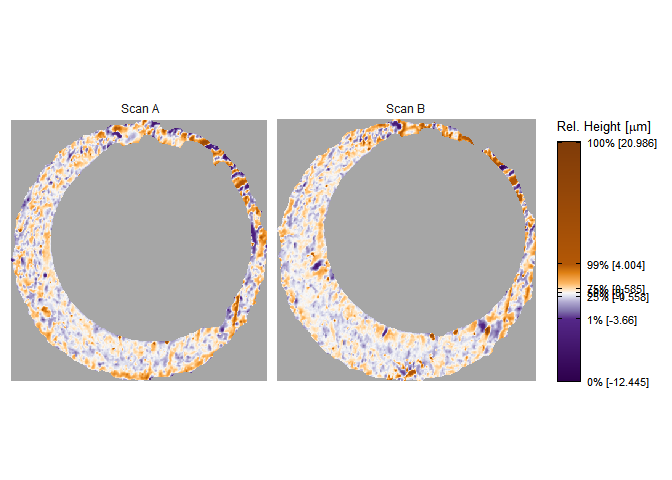
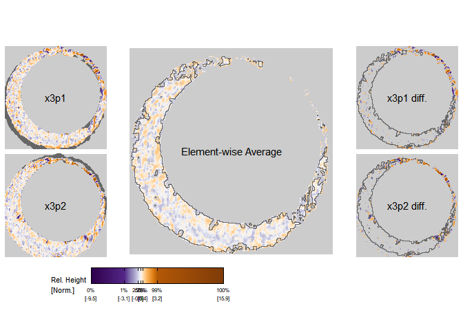

<!-- README.md is generated from README.Rmd. Please edit that file -->

# impressions 

<!-- badges: start -->
<!-- badges: end -->

An R package for diagnosing cartridge case impression comparison
algorithms.

## Installation

You can install the development version of impressions from
[GitHub](https://github.com/) with:

``` r
# install.packages("devtools")
devtools::install_github("jzemmels/impressions")
```

## Example

``` r
library(impressions)

library(cmcR)
library(tidyverse)

data("K013sA1")
data("K013sA2")
```

``` r
x3pPlot(K013sA1,K013sA2,
        x3pNames = c("Scan A","Scan B"))
```



### Comparison Plot

``` r
comparisonData <- cmcR::comparison_allTogether(K013sA1,K013sA2,
                                               theta = 3,
                                               numCells = c(1,1),
                                               maxMissingProp = .99,
                                               sideLengthMultiplier = 1.1,
                                               returnX3Ps = TRUE)
```

``` r
x3p_comparisonPlot(x3p1 = comparisonData$cellHeightValues[[1]],
                   x3p2 = comparisonData$alignedTargetCell[[1]],
                   legendLength = grid::unit(6,"in"),
                   legendQuantiles = c(0,.01,.05,.5,.95,.99,1))
```


