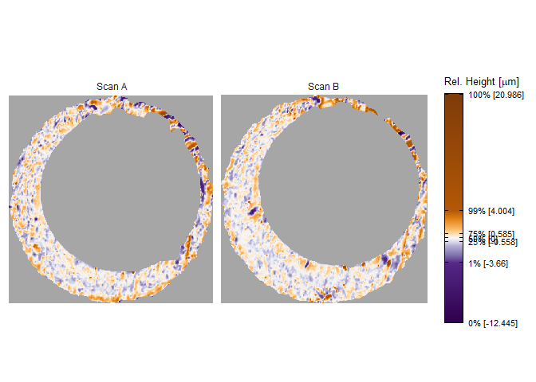
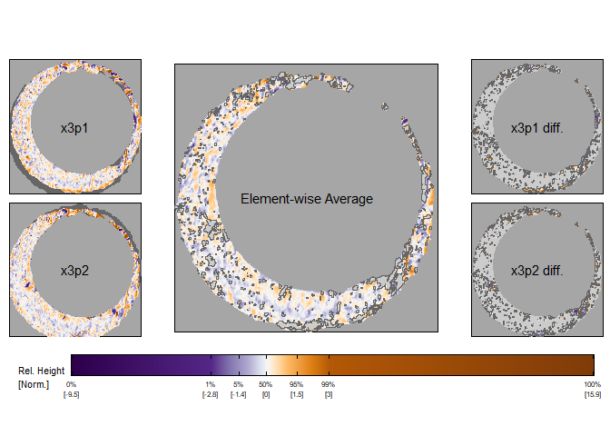

<!-- README.md is generated from README.Rmd. Please edit that file -->

# impressions 

<!-- badges: start -->

[](https://github.com/jzemmels/impressions/actions/workflows/R-CMD-check.yaml)
<!-- badges: end -->

An R package for diagnosing cartridge case impression comparison
algorithms.

## Installation

You can install the development version of impressions from
[GitHub](https://github.com/) with:

``` r
# install.packages("devtools")
devtools::install_github("jzemmels/impressions")
```

## Visual Diagnostics

As an example, consider two cartridge cases fired from the same Ruger
SR9 semiautomatic 9-mm handgun. Learn more about the collection of these
cartridge cases [here](https://www.ojp.gov/pdffiles1/nij/249874.pdf).
The cartridge cases are uniquely identified as “K013sA1” and “K013sA2.”
We assume that the markings on these cartridge cases left by the handgun
during the firing process are similar.

``` r
library(impressions)

library(cmcR)
library(tidyverse)

data("K013sA1","K013sA2")
```

Below is a visual of the two cartridge case scans. Note that these scans
have already undergone some preprocessing to emphasize the breech face
impression markings. The similarity between these cartridge cases is not
immediately apparent. The color scheme of these plots is chosen to
highlight extreme values (far from the median value) in the scan,
meaning small, local similarities are not highlighted. We can use visual
diagnostics available in the `impressions` package to understand the
similarity between these scans.

``` r
x3pPlot(K013sA1,K013sA2,
        x3pNames = c("Scan A","Scan B"))
```



### Comparison Plot

The comparison plot is a powerful tool to separate two cartridge case
scans into “similar” and “different” regions. First, we attempt to align
these two scans by rotating and translating K013sA2 to match K013sA1. We
use the `cmcR::comparison_allTogether()` function to estimate this
alignment. For the sake of this example, we’ll consider K013sA2 rotated
by 3 degrees and translated to maximize the cross-correlation function
with K013sA1.

``` r
comparisonData <- cmcR::comparison_allTogether(K013sA1,K013sA2,
                                               theta = 3,
                                               numCells = c(1,1),
                                               maxMissingProp = .99,
                                               sideLengthMultiplier = 1.1,
                                               returnX3Ps = TRUE)
```

The resulting `comparisonData` data frame contains a transformed version
of scan K013sA2 after rotating/translating to align with K013sA1. We’ll
pass this transformed scan to the `x3p2` argument.

``` r
x3p_comparisonPlot(x3p1 = comparisonData$cellHeightValues[[1]],
                   x3p2 = comparisonData$alignedTargetCell[[1]],
                   legendLength = grid::unit(6,"in"),
                   legendQuantiles = c(0,.01,.05,.5,.95,.99,1))
```


