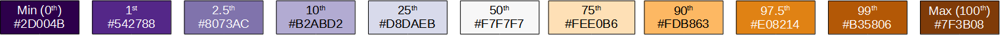

```{r, include = FALSE}
knitr::opts_chunk$set(
  collapse = TRUE,
  fig.align = "center",
  out.width = "60%",
  comment = "#>"
)
```

The `x3pPlot()` (or `x3p_plot()`) function creates a visualization of one or more x3p objects using the `ggplot2` package.

We use base `ggplot2` in `x3pPlot()`, so you can easily change these settings if you're already familiar.
The `x3pPlot()` function essentially consists of a call to `geom_raster()` with possible faceting and setting default features such as the pixel color scale, legend, etc.
In this vignette, we discuss how to change characteristics of the plot.

## Basic usage of `x3pPlot`

```{r setup}
library(impressions)
library(ggplot2)

data("K013sA1")
data("K013sA2")
```

First, let's make sure that we understand the basic functionality of `x3pPlot()`.
This section will discuss how the arguments of `x3pPlot()` expose some of the underlying `ggplot2` functionality to change the output.
Experts of `ggplot2` can ignore these arguments by simply adding (`+`) desired changes to the `ggplot2` object returned by `x3pPlot()`.
The sections after this one show how you can extend the functionality of `x3pPlot()` using `ggplot2`.

The `x3pPlot` function takes as its first argument(s) a sequence or list of x3p objects.
The code below demonstrates what we mean by a "sequence" in that they can be separated by commas.
We see that the output visualizes the surface values of the two x3p objects on the same color scale using faceting.
If not specified, the facet labels are set to `x3p[0-9]{1,}` up to the number of x3p objects passed.

```{r}
x3pPlot(K013sA1,K013sA2)
```

Wrapping these objects within a `list()` provides the exact same output.^[We provide this flexibility of input because of the two expected use cases.
One common use case will be that you have an x3p object loaded directly into your environment (e.g., by running `data("K013sA1")` as in this vignette).
In this case, it's nicer to pass the name of the object directly into the `x3pPlot()` function rather than wrapping it first in a list.
The second expected use case is when you have a list of x3p objects stored in the column of a data frame-like object such as a `tibble()` -- this is the case when comparing cartridge cases using the `cmcR` or `scored` packages.
In this case, it's easier to pass the whole column, like `df$x3pCol`, than flattening the column first.]

```{r}
# exact same output as above, so not shown:
# x3pPlot(list(K013sA1, K013sA2))
```

### `x3p.names` argument

The other arguments in `x3pPlot()` change characteristics of the plot.
First, we can change the facet labels; either by setting the `x3p.names` object or by passing a named list.
Note that `x3p.names` is ignored if a named list is used.

```{r}
x3pPlot(K013sA1,K013sA2,x3p.names = c("Scan A","Scan B"))

# exact same output as above, so not shown:
# x3pPlot(list("Scan A" = K013sA1, "Scan B" = K013sA2))
```

### `output` argument

The `output` argument specifies whether the x3p objects are visualized on the same color scale using faceting, or if each x3p object is visualized on its own color scale and the output is a list.
The former is useful for comparing the surface values across two or more scans.
The latter output is useful if you have x3p objects whose surface values are on different scales, meaning one scan's surface values would "drown out" others.

```{r}
x3pPlot(K013sA1,K013sA2,output = "list")
```

### `height.colors`, `height.quantiles`, and `na.value` arguments

By default, the color scheme used in `x3pPlot()` is a mapping of the x3p object surface value quantiles to a divergent purple, white, orange color scale.
The median surface value is mapped to white (technically a very light gray) while values below/above the median are mapped to progressively darker shades of purple/orange, respectively.
The `na.value` argument is set to `"gray65"` by default.
The image below summarizes the mapping between 11 surface quantiles and hexidecimal colors.
We chose this mapping because we found that it highlighted the distinguishable markings on a cartridge case surface well.

{width=100% align="center"}

The `height.colors` and `height.quantiles` arguments allow you to change the color scale and quantile mapping.
For example, the code below maps equally-spaced quantiles to grayscale.
This color scale doesn't distinguish between values below or above the median surface value.
We also change the `na.value` argument for illustration.

```{r}
x3pPlot(K013sA1,K013sA2,
        height.colors = paste0("gray",seq(0,100,by = 10)),
        height.quantiles = seq(0,1,by = .1),
        na.value = "red")
```


### `legend.quantiles` and `legend.length` arguments

Keen eyes may be twitching at the plot legends in the previous examples.
The tick marks on the plot legend are spaced such that the first, second, and third quartile labels are bunched-up and overlapping.
We can give the legend quantile labels some breathing room using the `legend.quantiles` argument.
We can also adjust the legend length using the `legend.length` argument, which internally is passed to the `barheight` argument of `guide_colorbar()`.

```{r}
x3pPlot(K013sA1,K013sA2,
        legend.quantiles = c(0,.01,.5,.99,1),
        legend.length = grid::unit(1,"in"))
```


## Color scale

We've already discussed how you can redefine the quantile color scale mapping in the `x3pPlot()` function.
If you want to change to a color scale that isn't based on quantiles, then you can simply overwrite the old color scale using your choice of `scale_fill_*` function.
The `scale_fill_gradient2()` example below illustrates why the previous quantile mapping is useful -- most of the surface values *aren't* extreme or distinguishable, so the quantile mapping makes the less populous, more interesting impressions more visible.
Note that you will get a warning for overwriting the previous color scale that you can suppress by wrapping the visualization call as `suppressWarning(print(...))`

```{r}
plt <- x3pPlot(K013sA1,K013sA2,legend.length = grid::unit(1,"in"))

plt + 
  scale_fill_gradient2(low = "purple",mid = "white",high = "darkorange",midpoint = 0)
```

### Legend

The legend can be changed using `theme()` and/or `guide_colorbar()` as below.

```{r}
plt +
  theme(legend.position = "bottom") +
  guides(fill = guide_colourbar(barwidth = grid::unit(2,"in"),
                                barheight = grid::unit(.1,"in"),
                                title = "New Title",
                                title.position = "bottom",
                                label.position = "top",
                                label.theme = element_text(size = 6,
                                                                    angle = 90),
                                title.theme = element_text(size = 8),
                                frame.colour = "white",
                                ticks.colour = "white"))
```


## Axis Features

We hide the axis information by default.
However you might want to include axis text or ticks.
You can add a new theme to the plot to override the previous settings.
We prefer `theme_minimal()`, but you do you.

```{r}
plt +
  theme_minimal()
```

Note that the axis text below shows *pixel*-wise increments by default.
If you instead want to show the physical size of each scan, say in micrometers ("microns" or $\mu$m for short), then you'll need information about the scan resolution.
In this example, both scans `K013sA1` and `K013sA2` have a lateral resolution of approximately $7.4 \times 10^{-6}$ meters, or 7.4 micrometers, per pixel as you can see in the `incrementY` (or `incrementX`) element of the x3p objects.
We use `scale_x_continuous()` and `scale_y_continuous()` to change the axis labels to the micron scale.
Notice how we use the `expression()` function for the $\mu$m abbreviation.
We see that both scans are approximately 3000 $\mu$m in both directions.

```{r}
K013sA1$header.info$incrementY #same as incrementX
# K013sA2$header.info$incrementY # same as above

plt +
  theme_minimal() +
  scale_x_continuous(labels = function(x) round(x*K013sA1$header.info$incrementX*1e6)) +
  scale_y_continuous(labels = function(y) round(y*K013sA1$header.info$incrementY*1e6)) +
  labs(x = expression("Horizontal Extent ["*mu*"m]"),
       y = expression("Vertical Extent ["*mu*"m]"))
```

## Faceting

Faceting allows multiple x3p objects to be visualized on the same color scale, which makes it easier to compare their surface values.
You can change the nature of the faceting by adding `facet_wrap()` or `facet_grid()`, which will overwrite the previous settings.
Within the `x3pPlot()` function, we convert each x3p object into a data frame and add a column called `x3p` that tracks the label associated with each scan.
You can facet the plot on this `x3p` column.
In the example below, you can see how the output changes depending on the faceting function used.

```{r}
plt +
  facet_wrap(~x3p,ncol = 1)

plt +
  facet_grid(rows = vars(x3p))
```

We can also change the facet labeling using `labeller()` as in the example below.

```{r}
plt +
  facet_wrap(~ x3p,
             labeller = labeller(x3p = c(x3p1 = "Scan A",
                                         x3p2 = "Scan B"),
                                 .default = function(string) toupper(string)))
```


